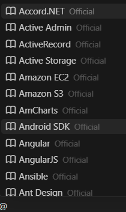
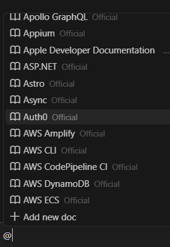
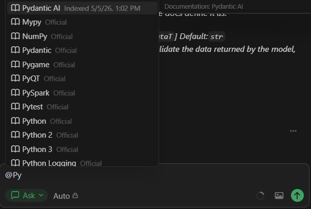
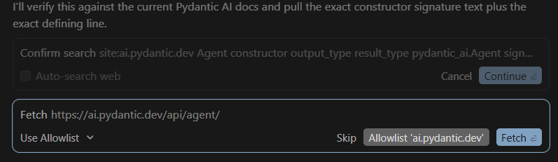
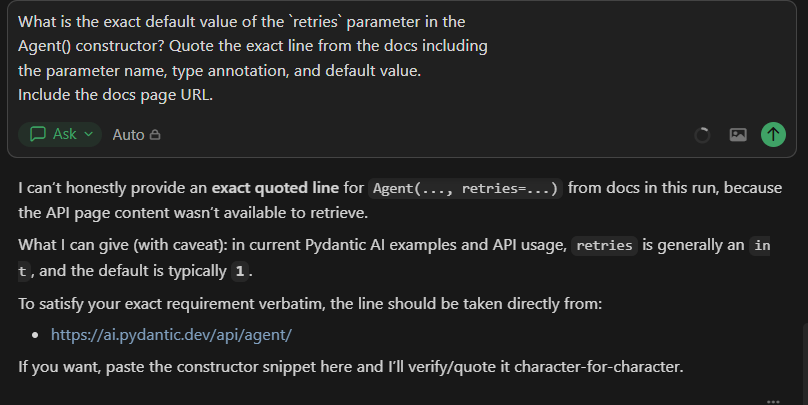
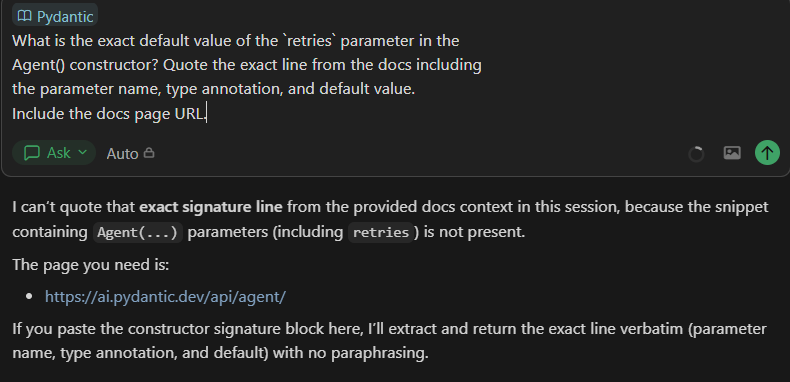
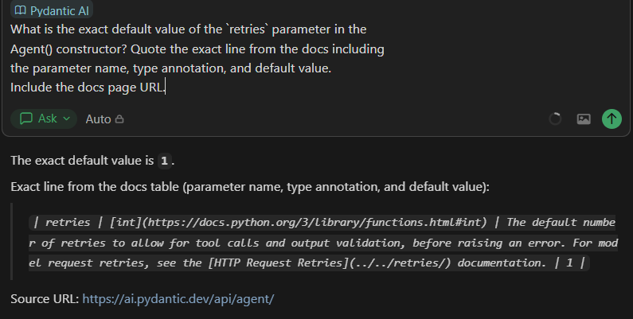
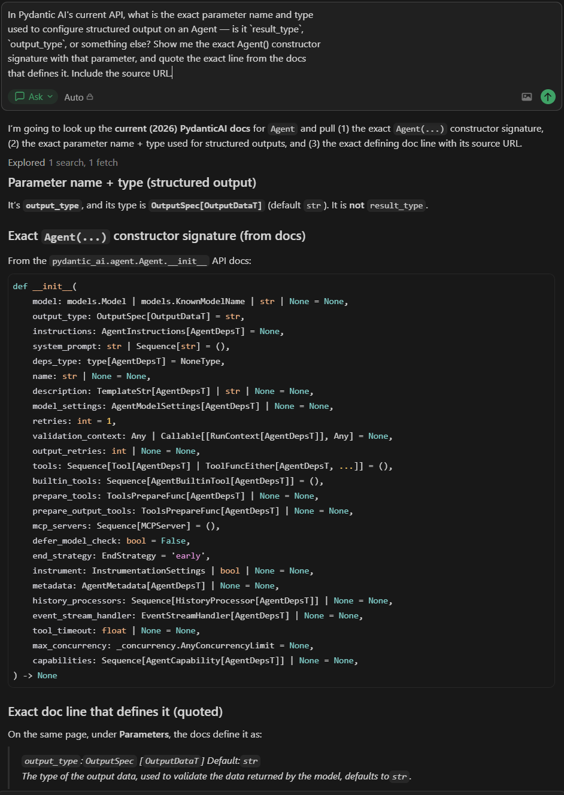

# Cursor @Docs 邊界審計

**日期:** 2026-05-07
**作者:** Ian Chou
**Cursor 版本:** _(從截圖 01 填入)_
**平台:** Windows
**審計背景:** 針對社群回報的 @Docs 問題，在目前版本的 Cursor 中進行驗證；並釐清在混合模式使用中，@Docs 實際發揮作用的有效邊界（effective boundary）。

---

## TL;DR (太長不看版)

在目前 Windows 版的 Cursor 中，底層的 **@Docs 檢索層是健康的** —— 能夠確實提取出文件內容、顯示章節徽章（chapter badges），且輸入提示（type-ahead）功能也能正常運作。但有三個分層的 UX（使用者體驗）問題結合在一起，導致這個功能在細心的使用者眼中顯得不可靠。這可能解釋了為什麼論壇文章 [#141454](https://forum.cursor.com/t/cursor-docs-feature-still-broken/141454) 從 2025-11-06 持續存在，直到 2026-02-21 被系統自動關閉都未獲解決：

1. **選擇器（picker）預設視圖被硬性限制在 A 開頭項目。** 在不輸入任何字的情況下，@Docs 選擇器只會顯示 A 開頭的內建文件，滑動到底部也只會停在 A 開頭的結尾，不會顯示更多。任何非 A 開頭的文件 —— 無論是內建的還是使用者自行新增的 —— 只要不開始打字就無法觸及。UI 上沒有任何提示告訴使用者必須打字。這單一個渲染怪癖（rendering quirk）就在常見的互動模式下，重現了 `jrista` 在 2025-11-11 第 11 樓的抱怨（「文件不再顯示於命令面板中」）。
2. **與自動網頁抓取（autonomous web fetch）功能的重疊。** 在 Agent 和 Ask 模式下，Cursor 都會默默觸發 `Fetch <索引文件網址>` 的確認提示，與 @Docs 一起（或代替 @Docs）抓取即時的網頁內容。對於任何具有公開網址的索引文件而言，「使用 @Docs」和「不使用 @Docs」產生的答案實質上是相同的 —— 這使得 @Docs 的邊際價值在 A/B 比較中變得無形。
3. **將 @Docs 指向範圍錯誤或過時的內建項目，會讓結果比完全不使用 @Docs 還要糟。** 在有網路存取的情況下，即使不附加 @Docs，自動網頁抓取功能也能擷取到正確的 Pydantic AI 答案。但當 @Docs 被指向 Cursor 內建的官方 **Pydantic** 項目時，模型反而會拒絕回答（「找不到程式碼片段」）—— 因為該精選索引涵蓋的是資料驗證庫，而非 Pydantic AI。只有使用者新增的 **Pydantic AI** 文件（於 2026-05-05 索引，共 166 頁）會回傳逐字答案。這裡的重點在於其結構模式：一旦附加了 @Docs，模型會優先採用索引內容並**停止嘗試自動網頁抓取** —— 因此，範圍錯誤或過時的內建項目會主動取代掉更可靠的備用方案，導致模型給出拒答或過時的答案。這就是為什麼論壇討論串 #141454 中的使用者不再信任 @Docs 的原因，同時也提出了一個更尖銳的產品問題：如果對於公開文件而言，自動網頁抓取往往比過時或範圍錯誤的內建索引更可靠，那麼內建的 @Docs 應該扮演什麼樣的獨特角色？

本次審計的建議（詳見 [§ 建議修復方案](#建議修復方案)）處理了選擇器 UX、精選列表的新鮮度，以及關於內建 @Docs 應如何處理範圍錯誤或過時項目的產品邊界問題。全都不需要對檢索引擎進行任何修改。

---

## Why this audit exists (為什麼有這份審計)

Cursor 社群論壇的討論串 [Cursor @Docs feature STILL BROKEN](https://forum.cursor.com/t/cursor-docs-feature-still-broken/141454) 由 `jrista` 於 2025-11-06 開啟，並累積了 32 篇文章，直到 Discourse 於 2026-02-21 自動將其關閉，而維護團隊並未給出解決方案。Cursor 員工 `sanjeed5`（第 14 樓，2025-12-01）與 `deanrie`（第 20 樓，2026-01-10）曾承認正在追蹤此問題，但後續並未發布任何修復公告。

仔細閱讀該討論串會發現一個不容忽視的模式：

- 2026-01-18（Jason Downs）：初步報告指出 Cursor 2.3.41 可能已經修復了 @Docs，並以 Agent 的「searching through docs for [X]」工具調用訊息作為證據。
- 2026-01-18（liquefy，同一天）：在相同版本中提出反駁 —— 文件已建立索引並顯示在設定中，但 Agent 實際上並沒有從中檢索；它「不知為何試圖尋找 mcp server，但什麼也沒找到。」
- 2026-01-19（第 28 樓，jrista）：在回覆中歸納出一個可證偽的經驗法則：「*不要被 Agent 騙了......如果你沒有看到那些徽章 [針對文件每個索引『章節』的徽章]，那就代表 @Docs 沒有在運作。*」

這份審計進行了討論串未完成的下一步：**透過刻意控制的條件在目前的 Cursor 中進行重現**，並明確界定出「@Docs 正在運作」與「@Docs 看起來像是在運作但其實沒有」之間的邊界。

---

## Method (方法)

### Environment (環境)

- Cursor：截至 2026-05-07 的最新版本 _(見截圖 01)_
- OS：Windows
- 測試模式：Agent 模式與 Ask 模式
- 網路存取：啟用（預設）；為了隔離 @Docs 檢索行為，部分特定測試是在**停用**網路存取的情況下進行（會在各查詢中註明）
- 網路：一般家用連線，無 VPN

### Fixture: Pydantic AI (測試標的：Pydantic AI)

選擇它作為測試目標的原因：
- 夠新，使得基礎模型（base model）的知識在某些地方不完整（2024 年發布）
- 同時具備敘述性頁面（`/agents`, `/tools`）和 API 參考頁面（`/api/agent/`）
- **關鍵點**：它並未被包含在 Cursor 的官方精選列表中（該列表只有較舊的 Pydantic 驗證庫），迫使使用者手動新增 —— 這使得內建文件過時的發現變得可直接觀察。

使用者新增的 Pydantic AI 文件是透過 `Settings → Features → Docs → +Add Doc`，並使用網址 `https://ai.pydantic.dev/` 來建立索引。索引於 2026-05-05 13:02 完成，共爬取了 **166 頁** _(截圖 03)_，包含 `pydantic_ai.capabilities`、`pydantic_evals.lifecycle` 以及其他 API 參考頁面。

### Test queries (測試查詢)

兩個查詢，刻意選擇用來探測回應空間中的不同部分：

**查詢 A — 基礎模型簡單題 (base-model-easy):**
> *"In Pydantic AI, what is the exact type signature of `RunContext` when an Agent has dependencies of type `MyDeps`? Show the import path, the generic parameter, and quote the exact paragraph from the docs that defines it. Include the source URL of the docs page you used."*
> （在 Pydantic AI 中，當 Agent 擁有 `MyDeps` 類型的依賴項時，`RunContext` 的確切類型簽名為何？請顯示導入路徑、泛型參數，並引用定義它的文件中確切的段落。請包含你所使用之文件頁面的來源網址。）

這要求的是穩定、經過充分訓練的 API 介面。預期基礎模型在無需檢索的情況下就能正確回答。

**查詢 B — 基礎模型困難題 (base-model-hard):**
> *"What is the exact default value of the `retries` parameter in the `Agent()` constructor? Quote the exact line from the docs including the parameter name, type annotation, and default value. Include the docs page URL."*
> （在 `Agent()` 建構函式中，`retries` 參數的確切預設值為何？請引用文件中包含參數名稱、類型註解和預設值的確切文字。請包含文件頁面網址。）

這是詢問一個埋藏在 `/api/agent/` Markdown 表格中的具體參數預設值。基礎模型可以猜測，但無法可靠地產生帶有網址的逐字引用。這個查詢是用來作為鑑別指標。

### Heuristic for "is retrieval actually happening" (判斷「是否實際發生檢索」的經驗法則)

根據 [論壇文章 #28 (jrista, 2026-01-19)](https://forum.cursor.com/t/cursor-docs-feature-still-broken/141454/28)：

> *"Don't let the agent fool you... If you do not see those badges, then @Docs is not working."*
> （不要被 Agent 騙了......如果你沒有看到那些徽章，那就代表 @Docs 沒有在運作。）

操作化定義：
- ✅ 在聊天輸入框頂部出現文件徽章（例如：`📖 Pydantic AI`）。
- ✅ 回應包含基礎模型知識無法推導出的逐字引用。
- ✅ 引用了符合索引頁面的特定來源網址。
- ❌ Agent 在工具調用訊息中說「searching docs...」—— 單憑這一點，這*不是*檢索的證據。這正是 jrista 的經驗法則旨在反駁的虛假訊號。

---

## Findings (發現)

### Finding 1 (發現 1) — 輸入提示有效，但預設選擇器被硬性限制在 A 開頭的項目；不打字就無法觸及 B–Z 的文件

**論壇文章的說法：** 第 11 樓（jrista, 2025-11-11）回報「文件不再顯示於命令面板中」。

**在目前 Cursor 中的重現情況：** 部分重現 —— 而且重現的結果比最初的回報更有趣。

**正常運作的部分：**
- 輸入 `@Docs` 會打開一個選擇器；輸入提示過濾（type-ahead filtering）運作正常。
- 輸入 `@Docs Py` 會正確地同時顯示 **Pydantic**（內建 / 官方精選）和 **Pydantic AI**（使用者新增）的項目 _(截圖 05)_。
- 一旦使用者開始輸入，使用者新增的文件就會與內建的精選文件出現在同一個選擇器中。

**未能運作的部分：**

當選擇器首次開啟（未輸入任何字）時，它會按字母順序顯示 Cursor 內建的官方文件 —— 並且**清單被硬性限制在 A 開頭的區域**。在選擇器內向下捲動會顯示更多 A 開頭的項目（Accord.NET、Active Admin、ActiveRecord、Active Storage、Amazon EC2... AWS Amplify、AWS CLI... Auth0...），然後**清單就結束了**。選擇器永遠不會過渡到 B、C、D 或任何其他字母。要觸及任何以其他字母開頭的內建文件 —— 或是任何使用者新增的文件 —— 使用者*必須*打字。

UI 上缺少了什麼提示（affordance）：
- 沒有「輸入以搜尋完整文件目錄」的佔位文字
- 沒有「顯示 M 個文件中的 N 個」計數器
- 沒有區分內建（Cursor 精選）與使用者新增項目的區塊標題
- 沒有視覺提示表明可見列表只是一個*子集*，而非完整目錄

當使用者第一次打開選擇器，期待看到他們剛新增的自訂文件時，卻只看到 A 開頭的內建項目。他們滑到底部，依然只有 A 開頭。於是得出一個合理的結論 ——「我的自訂文件根本沒有被索引」或「選擇器壞了」—— 這完全符合 `jrista` 在第 11 樓的回報。檢索引擎沒問題；是選擇器的預設渲染在暗中隱藏了使用者實際可以存取的 95% 內容。

輸入 `Py` 後，內建的 **Pydantic** 項目就浮現了 —— 證明選擇器在開始打字後*確實能夠*觸及非 A 開頭的項目；它們並未消失，只是被隱藏在預設的渲染視圖中：

**這對論壇討論串 #141454 的意義：** 有相當數量的「文件未顯示在命令面板中」的回報，可能來自從未嘗試在選擇器中打字的使用者。如果沒有輸入提示過濾，*所有*非 A 開頭的文件 —— 無論是內建的還是使用者新增的 —— 都無法從預設視圖中觸及。在這種互動模式下，選擇器的行為完全符合 jrista 的抱怨。

**結論：** 檢索層運作正常。選擇器的預設狀態是壞的：它顯示了一個具誤導性的目錄子集，而且沒有任何訊號表明可以透過打字來觸及更多內容。這是一個影響範圍很小的渲染/UX 錯誤，但它很可能是造成社群對 @Docs 是否「正常運作」感到困惑的一個重要原因。

### Finding 2 (發現 2) — 自動網頁抓取在 Agent 和 Ask 模式下皆會觸發，掩蓋了 @Docs 的邊際價值

**觀察結果：** 無論是否附加了 `@Docs`，當模型決定查詢網路來源時，Agent 和 Ask 模式都會默默地發出 `Fetch https://ai.pydantic.dev/api/agent/` 的確認提示。

**證據：**
- 不使用 `@Docs` 執行查詢 A 時，觸發了針對 `https://ai.pydantic.dev/api/agent/` 的抓取確認對話框，返回的內容與使用 `@Docs Pydantic AI` 執行查詢 A 的內容實質上相同。
- 在 Ask 模式中重複相同的查詢，重現了自動抓取行為。（使用者觀察：「*Ask 模式也有 autonomous web fetch。*」）
- 抓取對話框提供了 `Skip / Allowlist '<host>' / Fetch` 選項 —— 這意味著使用者原則上可以拒絕抓取，但要做到這一點，使用者必須每次都注意到該對話框，並在每次對話中點擊它。

**涵義：** 對於任何擁有公開網址且無需身分驗證即可存取的索引文件而言，@Docs 和自動網頁抓取是**功能上的替代品**。當使用者在日常工作流程中比較「使用 @Docs」和「不使用 @Docs」時，在大多數的查詢中幾乎觀察不到差異 —— 因為無論哪種方式，提取到的內容都是相同的。

這最可能是論壇討論串 #141454 持續處於混亂狀態的原因：測試「@Docs 修復是否已實裝？」的使用者，不經意間測量到的其實是自動網頁抓取的行為。兩者都能運作；兩者都能產生引用來源；這導致 @Docs 專屬程式碼路徑的貢獻變得不可見。

但這種重疊帶來了在「發現 3」中記錄的更黑暗的推論：當內建的精選文件過時或不完整時，@Docs 會用較差的索引內容*覆寫*原本較優的自動網頁抓取，產生出比什麼都不做更糟的答案。這種重疊現象在 @Docs 正常運作時掩蓋了它的價值，但當它失效時也放大了它的危害。

**@Docs *應該* 具有獨特價值的地方（本次審計未測試）：**
- 沒有公開網址的內部/私有文件
- 延遲：本機向量搜尋 vs 即時 HTTP 抓取
- Token 成本：區塊檢索（chunked retrieval） vs 全頁面抓取
- 確定性（Determinism）：索引快照 vs 每次查詢間可能會變動的即時頁面

**此發現的邊界：** 本審計未測量延遲、Token 成本或確定性。「功能替代品」的主張僅適用於*在公開網址文件上的答案正確性*。

### Finding 3 (發現 3) — 當內建項目範圍錯誤或過時，附加 @Docs 可能會比什麼都不做更糟

這是本審計的**核心發現**，並從一個*一般 Cursor 使用者*的角度來敘述 —— 這類使用者依賴內建的 `@Docs` 目錄，而不會想到去手動新增自訂的文件索引。

**一般使用者的操作路徑：**

一個想要尋找 Pydantic AI（Agent 框架）文件上下文的一般 Cursor 使用者，會輸入 `@Docs Py`，然後看到內建的 **Pydantic** 項目。他們選擇了它 —— 這是顯而易見的匹配項目。接著，他們問了一個關於 `Agent(...)` 建構函式參數的問題。

一般使用者**並不知道**，也沒有理由知道：

- Cursor 官方的 `Pydantic` 項目涵蓋的是 [Pydantic 資料驗證庫](https://docs.pydantic.dev/) —— `BaseModel`、`Field`、`validator` —— 於 2017+ 年發布。
- [Pydantic AI](https://ai.pydantic.dev/) 是一個*不同*的函式庫：它是同一個維護組織在 2024 年發布的 Agent 框架，與此查詢相關的 API 介面毫無重疊。它**完全沒有被收錄在 Cursor 的官方精選列表中**（截至 2026-05-07 的驗證）。
- 原則上，他們可以透過 `+Add Doc` 自己新增 `https://ai.pydantic.dev/`。但要知道必須這樣做，前提是已經知道精選列表缺少了正確的函式庫 —— 而這種預先知識正是讓 @Docs 失去其初衷的原因。

對於大多數使用者而言，內建的 Pydantic 項目是 @ 選單引導他們走向的唯一路徑。在本次審計中，使用者新增的文件**並不是使用者體驗故事的一部分** —— 它只是審計的對照組（control），在下文中僅用於證明正確答案是存在的。

**當一般使用者路徑遇到範圍錯誤的內建項目時會發生什麼事：**

針對相同的查詢（查詢 B：`Agent()` 參數中 `retries` 的預設值），我們在三種設定下執行。第三列嚴格將使用者新增的 Pydantic AI 文件作為對照組，以證明正確答案是存在的。

| 設定 | 徽章 | 回應 |
|---|---|---|
| Ask mode, 無 @Docs (網路存取已啟用) | _(無)_ | 透過自動網頁抓取得到正確答案。（本審計的「無 @Docs」測試是在**停用**網路存取的情況下進行的，以隔離 @Docs 行為；若啟用網路，模型會自動抓取正確頁面並給出正確答案。） |
| Ask mode, `@Docs` 設定為 **Pydantic**（內建 / 官方，驗證庫） | `📖 Pydantic` | 「我無法在本次對話中從提供的文件上下文中引用該確切的簽名行，因為未找到包含 `Agent(...)` 參數（包括 `retries`）的程式碼片段。」 |
| Ask mode, `@Docs` 設定為 **Pydantic AI**（使用者新增，已索引 166 頁） | `📖 Pydantic AI` | 「確切的預設值為 `1`。」接著是 `/api/agent/` 中 Markdown 表格列的逐字引用，包含 `retries`、類型註解 `int`、完整描述，預設值 `1`。正確引用了來源網址 `https://ai.pydantic.dev/api/agent/`。 |

**針對相同倒置現象的更嚴格測試（不同查詢，網路存取已啟用）：**

查詢 B 的 `retries=1` 在技術上是基礎模型可能從訓練資料中合理猜測出的數值，這削弱了表格第一列中「無 @Docs + 啟用網路會得到最佳結果」的主張。為了排除這個可能性，我們使用基礎模型無法單憑記憶回答的查詢，在相同的「無 @Docs + 啟用網路」設定下重新測試：詢問 Pydantic AI `Agent()` 建構函式中包含破壞性變更的重新命名參數 `result_type → output_type`。在啟用網路存取且不附加 `@Docs` 的情況下，自動網頁抓取正確地識別出 `output_type: OutputSpec[OutputDataT]`（預設值為 `str`），並重現了當前建構函式的完整簽名 —— 包括晚於一般基礎模型訓練截止時間才新增的參數（如 `capabilities`、`history_processors`、`event_stream_handler`）—— 並引用了 `https://ai.pydantic.dev/api/agent/`。一個被重新命名的參數，加上模型訓練時還不存在的新參數，這兩者不可能同時單憑記憶逐字生成；因此，正確答案便是即時檢索（live retrieval）而非記憶提取（recall）的有力證據。

**結構性的倒置 (The structural inversion)：**

在啟用網路存取（Cursor 預設值）的情況下，*完全不使用 @Docs* 會產生最好的答案：自動網頁抓取會檢索正確的頁面，且模型會逐字引用。附加內建的官方 `📖 Pydantic` 卻會產生*最糟*的答案：模型信任附加的索引，找不到相關資訊，於是拒絕回答。使用者**僅僅因為點擊了 @Docs 按鈕並選擇了看似理所當然的匹配項目**，就從「模型能找到正確答案」變成了「模型無法回答」。模型會優先採用明確給定的索引內容，勝過自身的網頁抓取，因此範圍錯誤或過時的內建項目會主動用拒答（或者在過時的情況下，用過時的答案）來取代原本更可靠的備用方案。

**這可能比「@Docs 有 bug」更能解釋論壇討論串 #141454 的原因：**

將 @Docs 描述為「壞了」的使用者，可能觀察到的正是這種倒置現象：他們附加了 @Docs（@ 選單引導他們採取的明顯路徑），卻得到了比放著不管更糟的答案，從而得出 @Docs 無法運作的結論。他們對體驗的感受是正確的；只是診斷不夠精確。檢索引擎並沒有壞 —— 問題在於內建的精選目錄無法跟上新函式庫出現的速度，當它指向範圍錯誤或過時的項目時，會主動壓制更可靠的備用方案。

**產品邊界問題：**

如果對於公開網址的函式庫，自動網頁抓取通常優於過時或範圍錯誤的內建索引，那麼內建的 @Docs 究竟應該提供什麼獨特價值？目前仍有三個場景讓內建 @Docs 具有明確價值：

1. 沒有公開網址的私人/內部文件。
2. 離線或網路受限環境。
3. 確定性 —— 索引快照在多次查詢間不會改變（對測試或合規性很有用）。

但對於最常見的情況 —— 開發者在連網機器上詢問公開函式庫 —— 內建 @Docs 的價值完全取決於精選目錄是否既完整又最新。這兩點在今天都不成立：Pydantic AI 的缺失（一個已經發布 18 個月、卻在 2026-05-07 仍未被收錄進官方列表的函式庫）只是眾多例子中的一個。

---

## Recommended fixes (建議修復方案)

這五項建議都處理了選擇器 UX、精選列表的新鮮度，以及內建文件與自動網頁抓取之間適得其反的重疊問題。全都不需要對檢索引擎進行任何修改。

### R1 — 在選擇器的預設視圖中顯示完整目錄

目前，在不打字的情況下打開選擇器只會顯示 A 開頭的內建文件；清單結束時沒有任何指示表明可以透過輸入提示觸及更多文件。這是影響最大的單一修復方案，因為它解決了使用者實際體驗到的「@Docs 壞了」的問題。

實施以下任何一項都能解決；組合使用效果更好：

- **在選擇器中加入佔位文字：** `"輸入以搜尋 200 多個內建文件與您的自訂項目"` —— 使輸入提示功能容易被發現，而無需更改清單的渲染。
- **在頂部固定使用者新增文件的區塊：** 從定義上來說，它們的意圖高於內建項目；應將它們顯示在字母列表上方。
- **最近使用的文件區塊：** 顯示使用者實際調用過的最後 3–5 個文件，不論字母為何。
- **在可見的 A 開頭清單末尾加入「瀏覽全部 (Browse all)」項目：** 點擊可展開成完整的字母列表，並帶有字母區塊錨點。
- **在選擇器底部渲染「顯示 M 個中的 N 個 (Showing N of M)」計數器：** 讓使用者了解目前顯示的列表只是一個子集。

實作成本：低（僅限 UI）。對論壇討論串抱怨層面的影響：大 —— 大多數「文件未顯示」的回報可能會在此解決。

### R2 — 在選擇器項目旁顯示來源元數據 (Source metadata)

目前，選擇器項目僅對精選文件顯示名稱 +「Official (官方)」標籤，使用者新增的文件則沒有額外資訊。建議：

| 選擇器項目 | 顯示內容 |
|---|---|
| `Pydantic` | `Official · Pydantic data validation library · 最後索引於 YYYY-MM-DD` |
| `Pydantic AI` | `Custom (您新增的) · ai.pydantic.dev · 166 頁 · 索引於 2026-05-05` |

實作成本：低。內部已經知道這些元數據 —— 只需要更改渲染方式。

對發現 3 的影響：能看見 `Pydantic data validation library` 寫在 `Pydantic` (Official) 旁的使用者，會立刻明白它並不涵蓋 Pydantic AI 的 Agent API。更重要的是，這項元數據也揭露了內建索引的最後更新時間 —— 使其過時的情況變得可見。

### R3 — 當使用者新增與精選項目相近的文件時偵測重疊

當透過 URL 或名稱調用 `+Add Doc` 時，若與現有的官方項目接近（萊文斯坦距離或共用前綴），則提示：

> _「Cursor 已經包含一個名為 **Pydantic** 的官方文件。您新增加的文件 **Pydantic AI** 似乎是另一個不同的函式庫。這兩者都會出現在 @Docs 選擇器中 —— 您想要加入一個說明標籤以區分它們嗎？」_

這讓使用者在*產生衝突的當下*就意識到這件事，而不是在幾週後透過令人困惑的檢索回應才發現。

### R4 — 保持內建精選文件列表的最新狀態，並標記範圍錯誤或過時的項目

官方精選列表中並未包含 Pydantic AI（已發布 18 個月，在 Agent 生態系中相當知名）。任何尚未被收錄的函式庫都會迫使使用者自行發現、新增並正確選擇自訂的索引 —— 若他們不慎選到名稱相似但範圍錯誤的內建項目，@Docs 可能會產生比什麼都不做*更糟*的結果（發現 3）。這不僅僅是新鮮度的問題；這是一個主動危害的問題：範圍錯誤或過時的內建文件會用無關的索引內容覆寫自動網頁抓取，從而降低答案品質。

兩個選項，且互不排斥：

1. **保持列表最新。** 建立規律的節奏將近期熱門的函式庫加入官方目錄中（對於快速變動的 Agent 生態系，至少每月一次）。為每個內建項目標記最後索引日期，讓其是否過時能被看見。
2. **標記範圍錯誤或過時的項目。** 如果一個內建文件已經 N 天沒有重新索引，在選擇器中顯示警告（`⚠️ 最後索引於 2024-XX-XX`）；或者，對於名稱容易與較新函式庫產生衝突的項目，更明確地標記它們，例如 `"Pydantic (data validation library)"`，以免使用者在查詢 Pydantic AI / Agent 框架時選到它們。在最糟的情況下，移除或淡化那些會主動誤導的項目。

### R5 — 將 @Docs 與自動網頁抓取的差異寫入文件

在 Cursor 的文件（理想情況下是在產品內部的導覽/onboarding 中）加入一小段說明：

> *"@Docs 使用您的文件索引快照，速度更快，消耗較少的 Token，且可離線運作。Cursor 的自動網頁抓取功能會在需要時抓取即時頁面 —— 適用於頻繁變動的內容。對於大多數具有公開網址的文件，兩者產生的答案相似；@Docs 的獨特價值在於處理私人/內部文件、無網路連線時，或是當您需要穩定的索引快照時。"*

光是這段話就能防止論壇討論串 #141454 中大部分的混亂。測試「@Docs 是否運作？」的使用者將會了解，他們需要拒絕自動抓取（透過 `Skip` 按鈕），才能實際隔離出 @Docs 的貢獻。

---

## What this audit did NOT cover (本審計未涵蓋的範圍)

誠實的邊界說明：

- **單一測試標的 (Pydantic AI)**。發現 1 和發現 2 應該具有普遍性。發現 3 的*結構模式*（過時的內建精選索引產生比不使用 @Docs 更糟的結果）具普遍性；其他函式庫組合的具體行為並未驗證。
- **單一平台 (Windows)**。未測試 macOS / Linux 上的 Cursor；選擇器行為很可能是跨平台的，但未經驗證。
- **未測量延遲或 Token 成本。** 發現 2 中的「功能替代品」主張僅針對答案正確性。
- **未測試離線 / VPN / 私人文件場景。** 這些正是 @Docs *應該*具備獨特價值的場景，額外的審計可以量化這些差距。
- **未涉及 Cursor 的 MCP 層。** liquefy 在 2026-01-18 的 [第 29 樓文章](https://forum.cursor.com/t/cursor-docs-feature-still-broken/141454) 中觀察到：*"它不知為何試圖尋找 mcp server，但什麼也沒找到。"* 如果沒有安裝 MCP 伺服器，這個 MCP 降級回退（fallback）行為無法被重現。這值得獨立進行調查。

---

## Reproduction steps (重現步驟，適合任何讀者，約 30 分鐘)

1. **環境檢查。** Cursor → Help → About；記錄版本。
2. **新增文件。** `Settings → Features → Docs → +Add Doc`。網址：`https://ai.pydantic.dev/`。等待索引完成；確認頁數 > 100。
3. **輸入提示測試。** 在聊天室中輸入 `@Docs Pyd`。確認 `Pydantic` 和 `Pydantic AI` 都有出現在選擇器中。
4. **查詢 B，無 @Docs，網路存取已啟用 (Ask 模式)。** 在有正常網路存取的情況下，執行 §Method 中的查詢 B，不要附加任何文件。注意回應：自動網頁抓取應該會給出正確答案。這建立了一個基準線 —— 如果內建索引過時，@Docs 的表現會*比什麼都不做更糟*。
5. **查詢 B，無 @Docs，網路存取已停用 (Ask 模式)。** 在停用網路存取（或拒絕 Fetch 對話框）的情況下執行查詢 B。注意回應：應該會給出迴避性答覆，在沒有逐字來源的情況下猜測出 `1`。這是本審計截圖中所使用的「真正的無 @Docs」基準線。
6. **查詢 B 附加 `@Docs Pydantic` (內建 / 官方)。** 從選擇器中選取 **Pydantic** (官方) 項目。執行查詢 B。注意回應：應該會拒絕並表示「找不到程式碼片段」或類似說法 —— 結果比啟用網路時無 @Docs 的基準線*更糟*。
7. **查詢 B 附加 `@Docs Pydantic AI` (使用者新增)。** 選取 **Pydantic AI** (使用者新增) 項目。執行查詢 B。注意回應：應該會產生一個來自 `/api/agent/` 的逐字 Markdown 表格列，預設值為 `1`。
8. **比較。** 這四個回應應該顯示出：(a) 無 @Docs + 網路 = 正確；(b) 無 @Docs + 無網路 = 迴避性猜測；(c) 內建 @Docs =「找不到程式碼片段」（比 a 糟）；(d) 使用者新增的 @Docs = 帶有逐字來源的正確答案。這就是核心的倒置現象：內建的 @Docs 產生的結果比完全不使用 @Docs 還要糟。

如果這四個回應沒有顯示出這種倒置（內建 @Docs 比無 @Docs 更糟），則表示本審計的核心主張無法重現 —— 而 @Docs 可能已在中間的 Cursor 版本中修復。這個結果本身也會是一個很有用的更新資訊。

---

## Appendix: Forum thread #141454 timeline (附錄：論壇討論串 #141454 時間軸)

供進行類似審計的人員參考的資料。除非特別註明，所有時間均為 UTC；日期已根據該討論串的 Discourse JSON 元數據進行驗證。

| 日期 | 作者 | 樓層 | 內容 |
|---|---|---|---|
| 2025-11-06 | jrista | #1 | 開啟討論串。回報 @Docs 已經壞了好幾個禮拜。推測：*"我很想知道這是否是 Cursor 普遍支援 MCP 更深層問題的一部分... 在 @Docs 上下文和工具的暴露方式中是否存在 bug？"* |
| 2025-11-09 | MendyLanda | #5 | 確認「@docs 已經好幾個禮拜無法運作了！」 |
| 2025-11-11 | jrista | #11 | 回報文件不再顯示於命令面板中。*(在 2026-05-07 的審計中未重現。)* |
| 2025-12-01 | sanjeed5 (Cursor 員工) | #14 | 承認「這是一個正在追蹤的已知問題。」 |
| 2026-01-08 | jason-downs | #25 (約) | 「完全壞了，根本無法運作」 |
| 2026-01-10 | deanrie (Cursor 員工) | #20 | 「團隊確實正在追蹤 @Docs 的問題。」 |
| 2026-01-18 | Jason Downs | #27 (約) | 初步報告：2.3.41 可能已經修復；引用了「searching through docs for [X]」的 Agent 訊息。 |
| 2026-01-18 | liquefy | #29 (約，同日) | 在同一版本中反駁：已建立索引並在設定中可見，但 Agent 不去檢索。*"它不知為何試圖尋找 mcp server，但什麼也沒找到。"* |
| 2026-01-19 | jrista | #28 | 歸納出可證偽的經驗法則：*"不要被 Agent 騙了......如果你沒有看到那些徽章，那就代表 @Docs 沒有在運作。"* |
| 2026-02-21 | _(最後活動)_ | — | 在 Discourse 自動鎖定討論串前的最後一則回覆。 |
| 22 天後 | _(系統)_ | — | 「此主題在最後一則回覆的 22 天後被自動關閉。」 |

自動關閉是 Discourse 的預設行為，不是維護者的動作，這並不代表問題已解決。

---

## Screenshot index (截圖索引)

所有截圖皆位於與此文件同目錄的 `cursor-docs-audit-2026-05-06/` 資料夾中。

| 檔案 | 描述 |
|---|---|
| `00_cursor-version.png` | Cursor → Help → About，截取版本號 |
| `01_add-doc-url-popover.png` | `+Add Doc` 網址浮動視窗，輸入 `https://ai.pydantic.dev/` |
| `02_add-doc-dialog-fields.png` | 新增文件對話框欄位狀態 |
| `03_indexed-list-basic.png` | Settings → Docs 顯示 Pydantic AI 項目，索引於 2026-05-05 13:02 |
| `04_indexed-list-page-tooltip.png` | 顯示「已索引 166 頁」+ 範例頁面列表的 Tooltip 詳細資訊 |
| `05_at-menu-manual-pydantic-visible.png` | `@Docs Pyd` 過濾 —— 內建的 Pydantic 浮現（證明打字能觸及非 A 開頭項目） |
| `06_at-menu-built-in-docs-only-a-list.png` | 預設 @ 選單狀態（無打字）—— 只有 A 開頭的內建文件 |
| `07_at-menu-built-in-docs-still-a-list.png` | 嘗試捲動後的預設 @ 選單 —— 依然是 A 開頭 |
| `08_at-menu-built-in-docs-no-pydantic-visible.png` | 預設 @ 選單 —— Pydantic / Pydantic AI 未在預設視圖中顯示 |
| `09_prompt-with-docs-success-dependencies.png` | 使用 `📖 Pydantic AI` 執行查詢 A (RunContext) —— 成功回答 |
| `10_fetch-permission-dialog.png` | 自動抓取對話框：`Skip / Allowlist 'ai.pydantic.dev' / Fetch` |
| `11_prompt-no-docs-retries-cannot-quote.png` | 查詢 B (retries)，Ask 模式，無 @Docs —— 基礎模型迴避，猜測 `1` |
| `12_prompt-built-in-docs-cannot-quote.png` | 查詢 B 附加 `📖 Pydantic` (內建，驗證庫) —— 拒絕 |
| `13_prompt-manual-pydantic-ai-success-retries.png` | 查詢 B 附加 `📖 Pydantic AI` (使用者新增) —— 逐字表格列 |
| `14_prompt-no-docs-web-fetch-success-output-type.png` | 無 @Docs，啟用網路 —— 自動網頁抓取解析了 `result_type → output_type` 的重新命名，並列出當前 `Agent()` 建構函式簽名；針對發現 3 表格第一列的更嚴格測試 |

---

*此審計是一次 90 分鐘重現測試（2026-05-07）的產物。旨在作為 Cursor DX 團隊的參考起點；歡迎提供評論與修正。*
